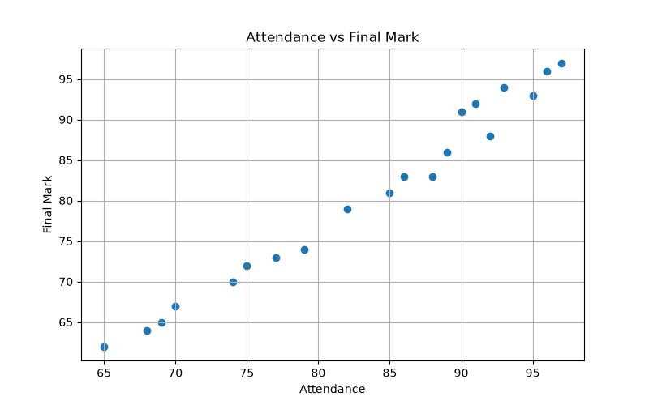
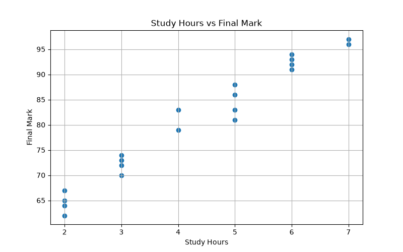
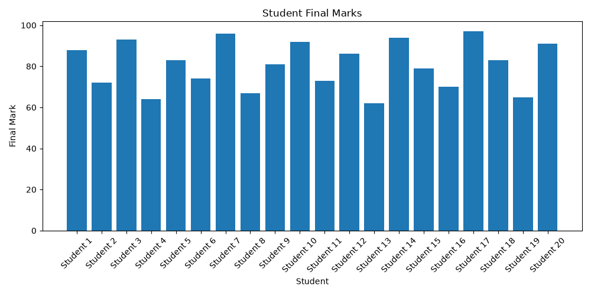

# 📊 Student Performance Analytics

## 📌 Project Overview

Student Performance Analytics is a data analytics mini project that analyzes students' academic performance using attendance, study hours, assignment marks, internal marks, and final marks.

The project uses Python and data visualization techniques to convert raw student data into meaningful insights.

## 🎯 Objectives

- Analyze student academic performance
- Identify high and low performing students
- Analyze the relationship between attendance and final marks
- Analyze the relationship between study hours and final marks
- Visualize student performance using charts

## 🛠️ Technologies Used

- Python
- Pandas
- Matplotlib
- CSV
- GitHub

## 📂 Dataset

The dataset contains the following attributes:

- Student
- Attendance
- Study Hours
- Assignment
- Internal
- Final Mark

## 🔄 Project Workflow

Raw Dataset  
↓  
Data Analysis using Python  
↓  
Average Calculation  
↓  
Performance Analysis  
↓  
Data Visualization  
↓  
Insights

## 📈 Visualizations

### Attendance vs Final Mark

This chart shows the relationship between student attendance and final marks.

### Study Hours vs Final Mark

This chart shows the relationship between study hours and final marks.

### Student Final Marks

This chart compares the final marks of different students.

## 💡 Key Insights

- Student attendance can be compared with final academic performance.
- Study hours can be analyzed to understand their relationship with final marks.
- Student-wise final marks can be easily compared using visualization.
- Data analytics helps convert raw academic data into useful information.

## 🚀 Future Enhancements

- Add more student records
- Create an interactive dashboard
- Add machine learning-based performance prediction
- Add real-time student performance analysis

## 👩‍💻 Author

Indhumathi Murugan

### Domain

Data Analytics